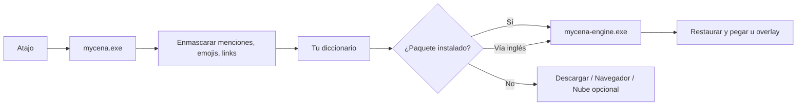

# Mycena

**Traductor de chat para Windows, ligero y offline.**
Escribe en tu idioma, envía en el de ellos. Lee lo que te escriben sin salir del chat.

> 🚧 En desarrollo. Las funciones marcadas en el roadmap aún no están listas.

---

## ¿Qué es?

Mycena vive en la bandeja del sistema y funciona con atajos de teclado en cualquier
app: Discord, WhatsApp Web, Telegram, juegos, el navegador. No es un bot ni un mod
de Discord; no toca ninguna app, solo trabaja con el texto que tú le das.

El nombre viene de *Mycena*, un género de hongos que forma parte de la red de
micelio por la que se comunican los bosques. Algunas especies brillan en la oscuridad.

## Cómo se usa

| Atajo | Acción |
|---|---|
| `Ctrl` `Alt` `T` | **Escribir**: traduce lo que escribiste en el chat y lo reemplaza. Tú decides cuándo enviarlo. |
| `Ctrl` `Alt` `R` | **Leer**: traduce el texto seleccionado y lo muestra en una ventanita flotante. |
| `Ctrl` `Alt` `L` | Cambia el idioma destino. |
| `Ctrl` `Alt` `Z` | Deshace la última traducción y devuelve tu texto original. |

Los atajos se pueden cambiar en la configuración.

## Características

- **Offline por defecto.** Traduce con modelos pequeños que corren en tu CPU.
  Tus chats no salen de tu PC.
- **Ligera.** Diseñada para no notarse: casi cero RAM y CPU cuando no la usas.
  El motor de traducción solo se carga cuando lo necesitas.
- **Respeta Discord.** Menciones, canales, emojis, links, código y spoilers
  se conservan intactos.
- **Tu propio diccionario.** Define cómo se traducen tus frases, tu slang y los
  nombres de tu gente en `frases.toml`.
- **Responde en su idioma.** Después de leer un mensaje en ruso, tu respuesta se
  traduce a ruso automáticamente.
- **Paquetes de idiomas bajo demanda.** Descargas solo los idiomas que usas.
- **Respaldos sin sorpresas.** Si no tienes un idioma, Mycena te ofrece
  descargarlo, abrirlo en el navegador o usar un traductor en la nube
  (solo si tú lo configuraste).

## Privacidad

- Mycena **no guarda** lo que traduces. El historial vive solo en memoria y
  desaparece al cerrar la app.
- **Nunca** envía texto a internet por su cuenta. La traducción en la nube es
  opcional, viene desactivada y solo se usa cuando tú la eliges.
- Usa atajos registrados con la API estándar de Windows (`RegisterHotKey`).
  **No** instala hooks de teclado ni lee lo que escribes fuera de los atajos.
- Las API keys opcionales se guardan cifradas con DPAPI, atadas a tu usuario de Windows.

Como usa el portapapeles y simula teclas, algún antivirus podría marcarla por
heurística. El código está abierto y los binarios se compilan en GitHub Actions
para que puedas verificar exactamente qué hace.

## Cómo funciona



- `mycena.exe`: bandeja, atajos y overlay. Siempre activa, mínima.
- `mycena-engine.exe`: el motor de traducción. Se abre al traducir y se cierra
  solo cuando dejas de usarlo.

## Rendimiento

| Métrica | Valor |
|---|---|
| Tamaño de `mycena.exe` | por medir |
| RAM en reposo | por medir |
| RAM traduciendo | por medir |
| Latencia por frase | por medir |

## Instalación

Próximamente en [Releases](../../releases): un `.exe` portable, sin instalador.

### Compilar desde el código

Requisitos: Windows 10/11 y Rust estable (toolchain MSVC).

```powershell
git clone <url-del-repo>
cd mycena
cargo build --release
```

Los binarios quedan en `target\release\`.

## Configuración

La configuración vive en `%APPDATA%\Mycena\`:

- `config.toml`: atajos, idiomas, motor, perfiles por app.
- `frases.toml`: tu diccionario personal.

Los paquetes de idiomas se guardan en `%LOCALAPPDATA%\Mycena\models\`.

## Roadmap

- [ ] Bandeja y atajos globales
- [ ] Modo escribir y modo leer
- [ ] Enmascarado para Discord y diccionario propio
- [ ] Overlay nativo
- [ ] Motores en la nube opcionales (DeepL, Claude)
- [ ] Motor offline y paquetes de idiomas
- [ ] Detección de idioma, pivote por inglés y respaldos
- [ ] Responder en el idioma del último mensaje
- [ ] Perfiles por app, deshacer e historial
- [ ] Inicio con Windows, DPI y tema claro/oscuro
- [ ] Releases automáticos con checksums

## Créditos

Los modelos de traducción usados por Mycena y sus licencias se listarán aquí
y en la pantalla "Acerca de" de la app.

## Licencia

MIT OR Apache-2.0
